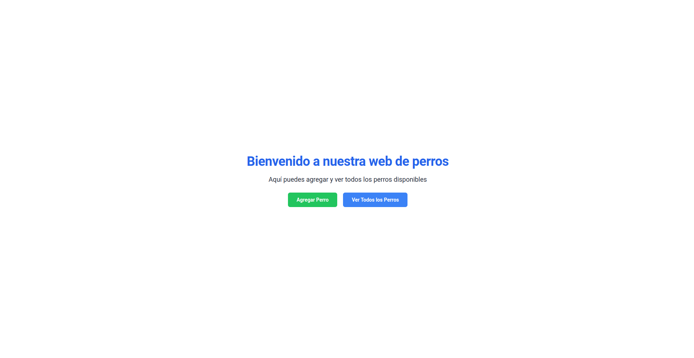
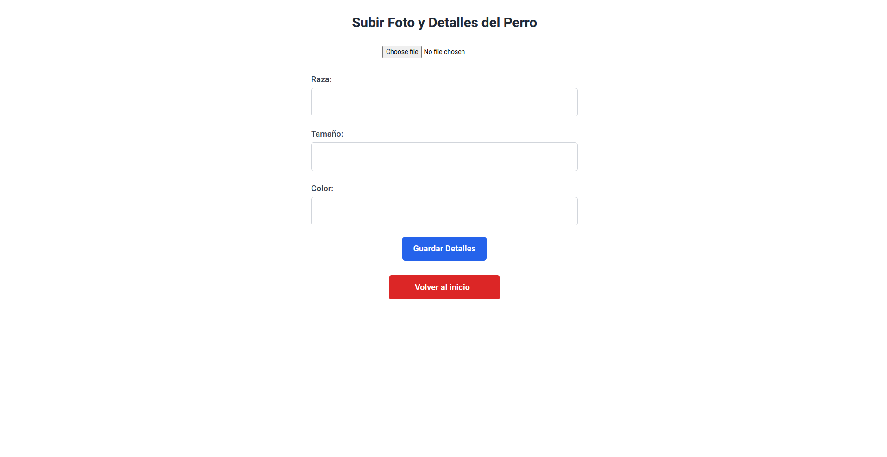
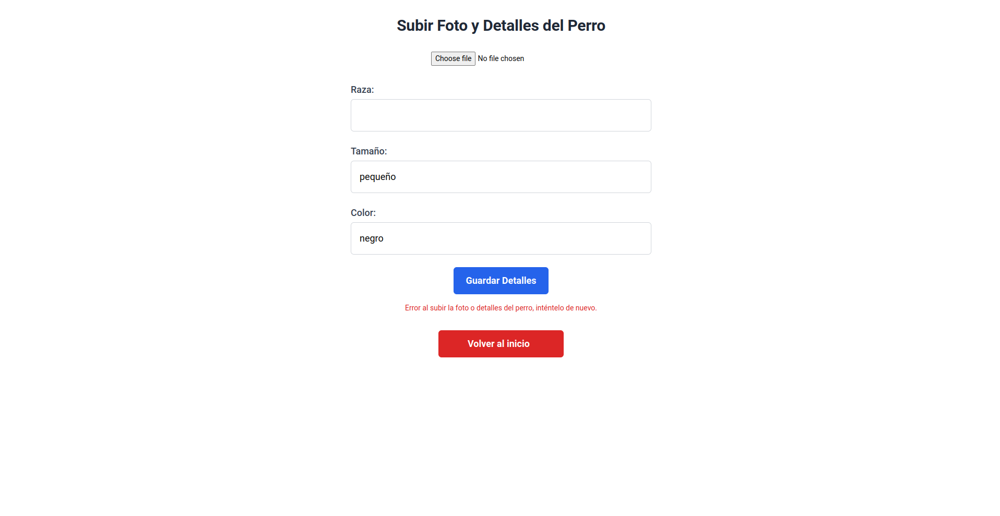
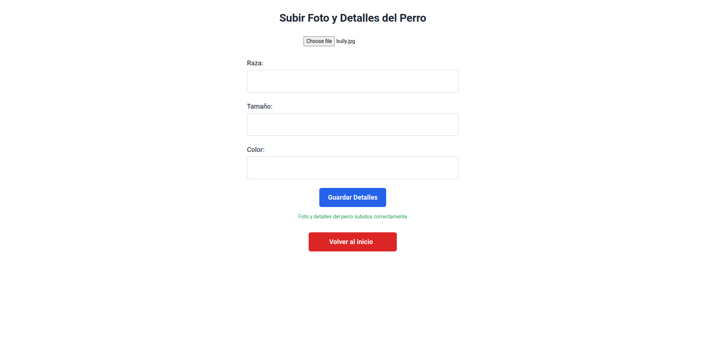
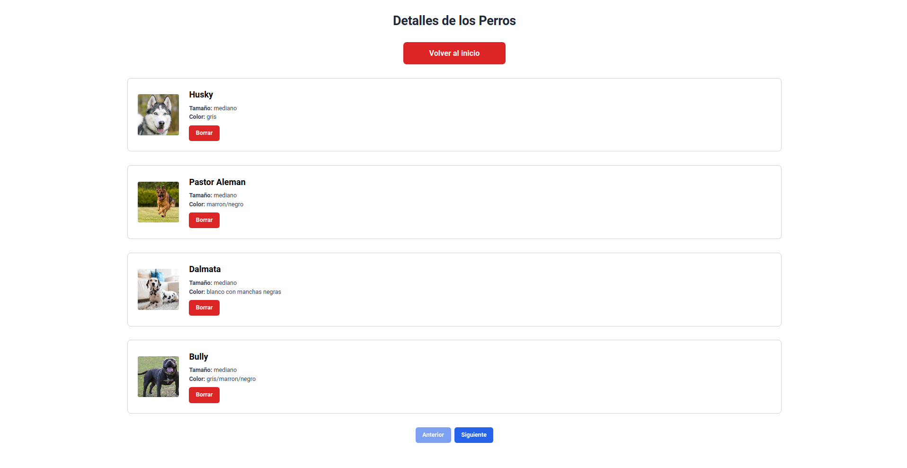

## Instalación del Proyecto

### Servidor
#### Requisitos Previos
PHP instalado en tu sistema. Puedes descargarlo desde [php.net](https://www.php.net/).
Composer, el administrador de dependencias de PHP. Puedes descargarlo desde [getcomposer.org](https://getcomposer.org/).
1. Clonar el Repositorio
   ```git clone <url_del_repositorio>```

2. Instalar Dependencias de Composer
   ```
    cd backend
    composer install
    ```
3. Configurar el Archivo .env:
    Copia el archivo .env.example y cámbiale el nombre a .env. Este archivo contiene la configuración de tu aplicación, como la conexión a la base de datos y las credenciales de seguridad.
    ```cp .env.example .env```

4. Iniciar Servidor
   ```php artisan serve```

### Cliente
#### Requisitos Previos
Asegúrate de tener Node.js y npm instalados en tu sistema. Puedes descargarlos desde [nodejs.org](https://nodejs.org/en).
1. Desde la raiz del repositorio clonado anteriormente usamos estos comandos. Con npm install instalamos las dependencias del proyecto.
   ```
   cd frontend
   npm install
   ```
2. Iniciar Cliente
   ```npm run dev```

3. Accedemos a la url que nos proporciona el lado del cliente.

   Ejemplo: [http://localhost:9000/#/]()

#### IMPORTANTE!!
Tanto backend como frontend deben estar levantados/corriendo para que el proyecto funcione.

### Funcionalidades y Páginas
   - IndexPage: Esta es la página principal al iniciar nuestro proyecto. El usuario podrá agregar un nuevo perro o ver todos los perros disponibles.


   - DogFormPage: Esta página nos permite agregar un perro nuevo a nuestro sistema. Elegimos la imagen, rellenamos los demás campos y listo. Resalto que si el perro ya está dentro del sistema o uno de los campos no están rellenados nos mostrará un mensaje de error y no se ingresará el perro. Si el perro es ingresado mostrará un mensaje de éxito. También tenemos un botón para volver al inicio.




   - DogDetailsPage: En esta página podremos visualizar a todos los perros dentro del sistema, podemos borrar el perro. Está paginado para que se muestre de 4 en 4


### Otras tecnologías
   - TailwindCSS

## Web Layout
Necesario tener NodeJS instalado, web creada con Vite.js.

1. Desde la raiz del repositorio clonado usamos los siguientes comandos.
   ```
   cd web-layout
   npm install
   ```
2. Iniciar Cliente
   ```npm run dev```

3. Accedemos a la URL que nos proporciona Vite.js
   Ejemplo: http://127.0.0.1:5173/
   


### Otras tecnologías
   - Bootstrap
   - Bootstrap Icons